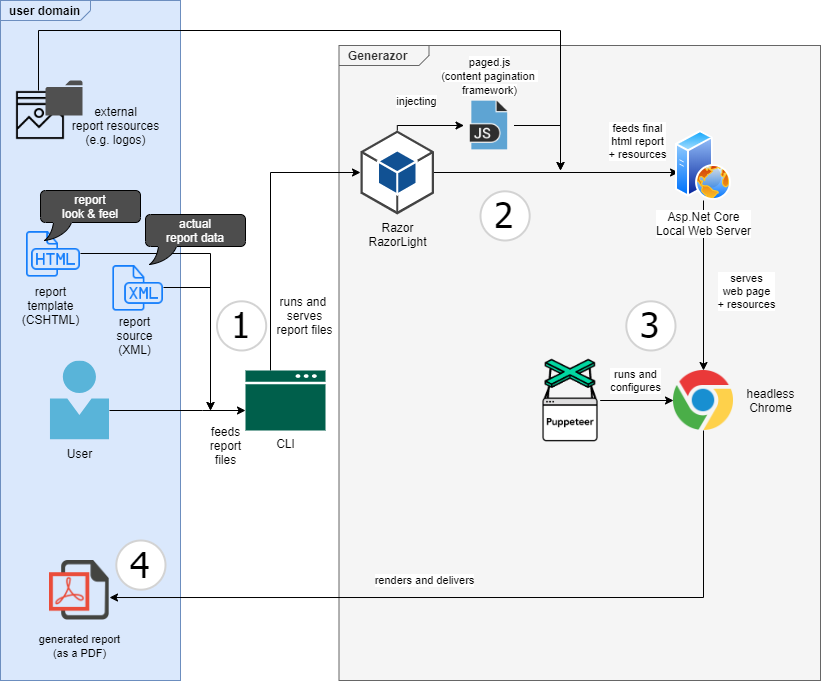

# Streamlining My Local Town Association's Reporting Needs

Being on the committee of an association puts you in charge of a lot of paperwork. Publishing regular reports on the whats an whys of the committee's decisions is an important legal obligation. Taking the minutes of all sorts of meetings and producing reports from these is a common way to account to the members of the association for the decisions that have been made.

Unfortunately, producing reports of high quality is still a time-consuming effort. Luckily, today's world of information technology allows us to choose from a plethora of tools that help us streamline the entire process.

In this article I'd like to show you what production setup I have put into practice over the past weeks to produce reports that are visually appealing and yet easy to handle for those producing them.


## The Context (you may skip this part)

A little background on my case: I'm responsible for taking the minutes of our local town association. With one to two meetings per month and two to three hours per meeting, there's quite a lot of paperwork to be done.

Working in IT I see it as my duty to produce high quality reports. At the same time I know how time-consuming it is to create a decent print layout. It starts with taking notes and making sketches during the meetings, which are then put into custom-made, pre-defined document templates usually using a UI-based word processor.

Unfortunately, these reports often go through multiple iterations. So you are never really done with them easily. In my case, a tentative pre-print version is sent to the committee for corrections and additions. Once these have been processed, the document is reviewed once more before it is going to print (or sent as a PDF to the members of the association via e-mail).

What is more, many parts of the give process are dull and repetitive. Naturally, wrangling with the layout of a UI-based word processor while rearranging, adding or deleting paragraphs is prone to errors.

Usually this overhead could be reduced by opting for a simpler setup. Markdown made into HTML would be a feasible solution, but it lacks in terms of visually appealing layouts.

What is needed is an integrated print production chain that can handle simple notes and produce top-notch PDF reports from them with the click of a button. Ideally, those notes shouldn't care about layout issues, they should only contain the text needed to create such reports. Layout issues should be dealt with by a template that can be reused for all future reports.


## The Requirements

The solution I was aiming for had to meet the following requirements:

+ it should be based on text (source) files to allow for the use of any version control system (preferably Git);
+ it should use a simple, semantic markup to allow for simple note taking which is flexible enough so that it can be used as the starting point for producing final reports without having to transform the notes into another (interim) format;
+ it should have a simple yet powerful templating engine so as to use ready-made layout templates or create new templates for special occasions;
+ it should produce print-ready, high quality PDF files;
+ it should be highly integrated and automated; ideally, I would want to feed the final source file (with a reference to the template file) into a program and be passed back the final PDF report.


## The Technologies Behind

This is what I have come up with:

I have opted for an **xml-based source format** that allows me to take notes and parameterize the final outcome according to my needs. I use a ready-made boilerplate file for each new report and just fill in the details as I go. This is especially useful for frequently recurring bits of information such as attendance lists, agenda items, action items, and meta information (e.g. time and venue of the meeting).

``` xml
<?xml version="1.0" encoding="UTF-8"?>
<minutes  
    title="Monthly Committee Meeting"
    subtitle="Meeting #3: March 2020"
    signature="M2020.3"
    date="05/25/2020"
    time="7:30 p.m."
    duration="2 hours 30 minutes"
    venue="Town Association Hall"
    chairman="AA"
    keeper="BB" 
    next-meeting="Monday, July 6, 7:30 p.m."
    version="1" 
    versiondate="06/03/2020"
    >

    <members>
        <member name="Andrea Awesome"  signature="AA" />
        <member name="Luisa Lemon"     signature="LL" absent="true" />
        <!-- ... -->
    </members>

    <guests>
        <guest name="Isabel Ingenious" signature="II" />
        <!-- ... -->
    </guests>

    <agenda>
        <item title="Review of last year's budget report">
            <info>Our treasurer JJ has laid forth his annual budget report (see attachment A1)...</info>
            <vote>The committee has reviewed the report and unanimously decided...</vote>
            <statement>The committee points out that...</statement>
            <task responsible="MM" deadline="06/30">The budget report will be sent to print immediately by MM and handed out to the members of our association no later than...</task>
        </item>
        <!-- ... -->
    </agenda>

    <attachments>
        <attachment signature="A1" title="Budget Report of 2019 by JJ" />
        <!-- ... -->
    </attachments>

    <!-- ... -->
</minutes>
```

The semantic structure of the generated report file is controlled by an **HTML template** file enriched with declarative [Razor Syntax](https://docs.microsoft.com/en-us/aspnet/core/mvc/views/razor?view=aspnetcore-3.1).

``` html
<!-- HEADER -->
<table class="head">
    <tr>
        <td class="label">Date</td>
        <td>@Model.Date.ToString("d", CultureInfo.InvariantCulture)</td>
        <td class="label">Time</td>
        <td>@Model.Time</td>
    </tr>
    <tr>
        <td class="label">Venue</td>
        <td>@Model.Venue</td>
        <td class="label">Duration</td>
        <td>@Model.Duration</td>
    </tr>
    <tr>
        <td class="label">Chairman</td>
        <td>@Model.Chairman</td>
        <td class="label">Keeper o.M.</td>
        <td>@Model.KeeperOfMinutes</td>
    </tr>
    <!-- ... -->
</table>
```

The layout specifics are handled by [print-optimized CSS3](https://www.smashingmagazine.com/2018/05/print-stylesheets-in-2018/). In order to give the layout a professional look and provide for special "print edge-cases", I had to look for improved print-support.

After all, things like headers, footers, counters, handling of page breaks (content fragmentation, pagination), etc. may all be irrelevant in terms of web-only publications but make a *huge* difference when it comes to print production (page layout). So, what CSS3 cannot do out of the box is taken care of by the awesome [Paged.js](https://www.pagedjs.org) library, "a free and open-source library that paginates any HTML content to produce beautiful print-ready PDF".


## Connecting the Dots

And this is how it all comes together. In short, the process goes like this: xml source file in, generated PDF file out. The specificy are explained below.



1. The user feeds the xml source file (together with a reference to the  template file) into a simple console application (based on C# and .Net Core).

2. The console application creates a "live object" of the xml source and runs this through the templating engine. I am using [Microsoft's Razor Engine](https://docs.microsoft.com/en-us/aspnet/core/mvc/views/razor?view=aspnetcore-3.1) (through [Ivan Balan's RazorLight](https://github.com/toddams/RazorLight)) for the razor processing. The template is enriched with various resource files such as the Pagedjs source and images that may be part of the template. The entire process returns the final HTML that is then saved locally.

3. The HTML file thus produced (along any dependencies) is then served by a local web server (using [ASP.NET Core and Kestrel](https://docs.microsoft.com/en-us/aspnet/core/fundamentals/servers/kestrel?view=aspnetcore-3.1)) and rendered (consumed) by a [headless version of Google Chrome](https://developers.google.com/web/updates/2017/04/headless-chrome). I use [Puppeteer Sharp](https://www.puppeteersharp.com) as a [Headless Chrome .NET API](https://github.com/hardkoded/puppeteer-sharp) for full control over the rendering process.
   
4. The final outcome is a high quality, print-ready PDF file, which is then returned to the user.


## Versioning and Version Control

I have enriched the entire process with some additional extras that help me keep track of my work and account for changes.

The source and template files (including any third-party references) are version controlled using git. Additions and corrections in the source XML itself can be accounted for easily. Each modification increases a predefined version counter (```version``` and ```versiondate``` in the root element) of the  document, which will be visible in the final report's footer. Thus, versioning is a core part of the entire system.


## Where to Go from here?

The entire print process is working smoothly, yet there are many areas of possible future improvements:

I would like to create an integrated environment for source and template file editing with live previews (I imagine [Electron](https://www.electronjs.org) could come in very handy here). That way templates could be created and modified easily, and note takers could write their minutes with a real-time preview of the generated file. 

PDF file generation takes about five seconds on standard off-the-shelf hardware. There is lots of space for performance improvements here. I would love to see the entire setup process hundred or thousand-page documents.

File type support for EPUB or Kindle (MOBI) documents would be an awesome improvement. A plug-in architecture could help extend the use cases of the entire process.
I imagine projects like [Calibre](https://calibre-ebook.com) and [Dog Tompson's Epub Creator](https://github.com/DougThompson/EpubCreator) could help tremendously here.

That's it. I will be happy to go into more specifics in a future post as well as publish the entire source of my setup online. If anyone is interested in the meanwhile, please drop me a line.