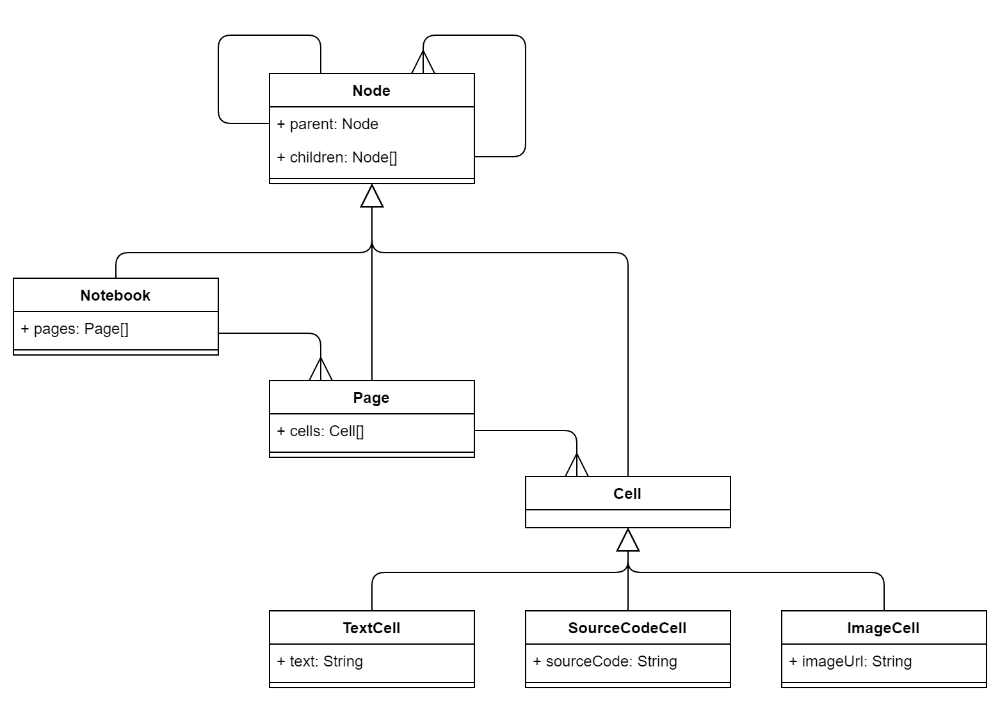

# The Visitor Pattern Exemplified in TypeScript

Every developer working with compositional data structures (Hello, [Trees](https://en.wikipedia.org/wiki/Tree_(data_structure))!) will eventually come across the **Visitor Pattern**, especially if their data is very heterogeneous (e.g. different types of tree nodes) and needs to work with an open set of operations on these.

In this article I will show what the Visitor Pattern is and how it can help you write robust and [*SOLID*](https://en.wikipedia.org/wiki/SOLID) code when facing said adversaries.

I will exemplify the pattern with the help of a real-world example written in TypeScript. The example will be a simple notebook app. We will start with a naive implementation of basic features and see where our code needs improving.

Along the way you will learn about the following core concepts of software development in general, and Object-Oriented Programming specifically:

* Compositional data types: trees and nodes
* KISS principle: Keep It Simple, Stupid!
* Polymorphism and polymorphic behavior in OOP
* SOLID Code I: Single-Responsibility Principle (SRP)
* SOLID Code II: Open-Closed Principle (OCP)
* Double Dispatch
* Visitor Pattern


## Real-World Problem: Jupyter-Like Notebooks
Imagine writing a notebook app for your fellow developers. These notebooks are hierarchical in nature: A notebook contains pages, a page contains cells. A cell is generally any kind of specific content that can be displayed and interacted with on a page, e.g. text, source code, images. 

If these features sound familiar, you are absolutely right: We are talking about [Jupyter-style notebooks](https://jupyter.org) here.

Given the key players just mentioned, we can draw a class diagram like the following:



As can be seen from the diagram, all players involved here inherit from the base type `Node`, which is the key element of our tree structure. The tree is a compositional data type (every `Node` instance can have multiple child nodes and, hence, a parent node) with heterogeneous data items (nodes of different types). `Node` subtypes are `Notebook`, `Page`, and `Cell`. The `Cell` type is an abstract type inherited from by different content cells, namely `TextCell` (for text), `SourceCodeCell` (representing source code), and `ImageCell` (for images). It is more than likely that other content cells will be added in the future.

So far, this looks all fine and dandy. Now, imagine your colleagues having already written the entire stack for your notebook application: The backend is running smoothly and the frontend lets your notebooks shine in a modern javascript-based web app. Now comes your part!


## Feature Request: Exporting Notebooks

Your boss enters the stage and asks you to implement a new feature. Users are very happy with the app but feel a bit locked in. They would very much like to be able to export their notebooks to Markdown, XML, and HTML (for starters). Keep in mind that this is a potentially open-ended feature, other formats to export to can be and will be added in the future.

So, how would you implement the export feature?


## First Idea: KISS &mdash; Keep It Simple, Stupid!

Let's start exporting our notebooks to HTML. No biggie, you think and get to work. You know about the [**KISS Principle**]() and what it requires you to do now:

> **KISS: Keep It Simple, Stupid / Keep It Stupid(ly) Simple** is a design principle in software development (and engineering in general) that favors simple solutions over unnecessarily complex ones. Simplicity is a key design goal that offers great benefits, yet is hard to master.

To keep things simple, you feel pretty confident that you can just add an `exportToHtml()` method to the `Node` type:

```typescript
abstract class Node {
    // ...

    public exportToHtml(): string
    {
        // ...
    }
}
```

Nice, that surely looks simple!

## Iterate and improve: Make that Polymorphic!

You pause for a second and contemplate your work: This is a good start, but you could potentially improve this a lot by making the method abstract. That way each concrete implementation of `Node` (e.g. `ImageCell`, `TextCell`) can produce a specific HTML output. After all, an `ImageCell` will very likely produce HTML that is markedly different from that of a `TextCell`.

What you are doing here now is thinking in terms of a core concept of **Object-Oriented Programming** (OOP) called [**polymorphism**](https://en.wikipedia.org/wiki/Polymorphism_(computer_science)):

> **Polymorphism** is the notion of having a *single interface* show *different forms of behavior* depending on the concrete type that implements the interface. This notion is a core concept in OOP and receives it name from an ancient Greek origin meaning "having various forms".
> 
> For example: If the types `Dog` and `Duck` inherit from a common base class `Mammal` and this class defines a method `makeSound()` (the *single interface* part), then `Dog` would implement it producing a *barking* sound, while `Duck` would implement it making a *quack* sound (the *different forms of behavior* part).

So, you go ahead and make the `exportToHtml()` method abstract and have your different `Node` subtypes implement it to their specific needs. Here are two examples:

```typescript
class ImageCell extends Cell {
    // ...

    public exportToHtml(): string
    {
        return `<image src="${this.imageUrl}">`;
    }
}

class TextCell extends Cell {
    // ...

    public exportToHtml(): string
    {
        return `<p>${this.text}</p>`;
    }
}
```

You pause again to think: Now that you have added the export functionality for HTML, you just have to add the same logic for the remaining export formats. And again, you would make those new methods abstract and implement them in their specific subtypes. It's quite a lot of typing, and starts to feel a bit verbose, but for now you just plug away...

```typescript
export abstract class NodeBase {
    // ...

    public abstract exportToHtml(): string;
    public abstract exportToXml(): string;
    public abstract exportToMarkdown(): string;
}

class ImageCell extends Cell {
    // ...

    public exportToHtml(): string
    {
        return `<image src="${this.imageUrl}">`;
    }
    public exportToXml(): string
    {
        return `<image url="${this.imageUrl}" />`;
    }
    public exportToMarkdown(): string
    {
        return ``;
    }
}

class TextCell extends Cell {
    // ...

    public exportToHtml(): string
    {
        return `<p>${this.text}</p>`;
    }
    public exportToXml(): string
    {
        return `<text>${this.text}</text>`;
    }
    public exportToMarkdown(): string
    {
        return `\n${this.text}\n`;
    }
}
```

Wow, now that escalated quickly. Look at all that code!


## If it Smells Fishy, it Probably Is: Violation of 'Open-Closed'

Something doesn't feel right here. Your code surely *looks* simple, but you don't like the idea of having to add a new method for every new export format that could potentially come your way in the future. It works, but this is one hell of a maintenance nightmare.

Indeed, looking at your code thoroughly it starts dawning on you that you have just violated one of the core SOLID principles, namely the [**Open-Closed Principle**](https://en.wikipedia.org/wiki/Open–closed_principle): 

> The **Open-Closed Principle** (OCP) states that software entities (such as classes, modules) should be *open for extension, but closed for modification*.
> 
> In other words, classes, modules and the like should be able to accommodate new functionality (the *open for extension* part) without having to be rewritten or even touched upon (the *closed for modification* part).

Clearly, the code you just wrote is open for extension (you can add any export format you want) but it is definitely *not* closed for modification. On the contrary: with each new export format you would have to modify the `Node` type and its various subtypes.


## When it Rains, it Pours: Violation of 'Single Responsibility'

But there is more to it: The entire export logic is distinctly different from what those `Node` subtypes usually deal with. Their core logic revolves around the management of `Page`s (for `Notebook`s), `Cells` (for `Page`s), text (for `TextCell`s), source code (for `SourceCodeCell`s), etc. The export logic you just added feels misplaced (not to mention the fact that the various target formats of HTML, Xml, and the like, are themselves incompatible to one another!).

 The export logic being part of the core `Node` subtypes logic now violates yet another principle: the [**Single-Responsibility Principle**](https://en.wikipedia.org/wiki/Single-responsibility_principle):

> The **Single-Responsibility Principle** (SRP) demands that a class have only a single responsibility. Specifically, this means that a class should have only "one reason to change" (Martin, Robert C.: Agile Software Development, Principles, Patterns, and Practices. Prentice Hall. p. 95.).
> 
> For example: You are writing an `HTMLExporter` class that exports your entire `Notebook` object to HTML. The feature works well, but after some time a new version of HTML comes along, thus forcing you to update your export logic. So far, so good.
> 
> Some weeks later, the entire logic breaks suddenly. Users start complaining because they can no longer export their notebooks to their hard drives. Turns out the OS vendor has brought out a new version of the underlying file system storage. Your `HTMLExporter` writes its contents directly to the disk, and this logic is no longer compatible. You are forced to update the class yet again to restore compatibility with the filesystem changes.
> 
> *This is a clear sign that you have violated the SRP*! Your class takes on at least two responsibilities: Converting notebooks to HTML *and* saving the HTML to the disk. Two responsibilities means at least two reasons for your class to change, which goes against the principle of SRP.

The problem with our export logic inside the `Node` subtypes is that whenever the requirements regarding the node subtype logic change, you would have to modify the subtypes. Likewise, whenever the requirements for any of the export features change (new version of HTML, Markdown, Xml, or the like), you would have to modify the subtypes *yet again*. Those are too many reasons for your classes to change, hence too many responsibilities.

Looking at your code you come to the conclusion that something is going terribly wrong. By adding just a few simple features, and despite your best efforts of KISSing and using Polymorphism, you have managed to violate two core SOLID principles (OCP and SRP). That's quite an achievement!

Now let's see how we can get out of this mess to make both you, your fellow developers and your boss happy.


## Enter: The Visitor Pattern

So far, the core problem is this: We have a heterogeneous, compositional data structure (our tree with its `TextCell`s, `SourceCodeCell`s, `ImageCell`s, `Page`s, ...) that needs to accommodate different types of operations (`exportToHtml()`, `exportToXml()`, `exportToMarkdown()`, ...). These operations are very specific to the types they operate on and the entire set is principally open-ended, meaning that it is more than likely that more operations will have to be added at a later point.

Extending the set of operations should, however, not lead to a modification of the existing class hierarchy. It should be possible to extend the current functionality without modifying the existing classes, thus keeping in line with the *Open-Closed Principle*. 

Moroever, we need to add new operations in such a way that classes remain in charge of single responsibilities, thus obeying the *Single Responsibility Principle*.

These requirements are a perfect fit for the [**Visitor Pattern**](https://en.wikipedia.org/wiki/Visitor_pattern):

> The **Visitor Pattern** in OOP is a behavioral design pattern that allows logic to be added to an existing hierarchy of classes without modifying them. Thus, the Visitor Pattern separates the added behavior from the classes the behavior operates on.

We shall implement the Visitor pattern for our solution in two simple steps.

## First Step: Separating the Export Functionality

At this point we know we have to keep the export logic in separate classes in order to satisfy the SRP. We will have to write separate classes, one for each export format. All these classes will have to accept any `Node` subtypes in order to export the entire `Notebook`.

Let's create a simple interface to this logic and name it `NodeExporter`:

```typescript
interface NodeExporter
{
    exportNotebook(notebook: Notebook): void;
    exportPage(page: Page): void;
    exportImageCell(cell: ImageCell): void;
    exportSourceCodeCell(cell: SourceCodeCell): void;
    exportTextCell(cell: TextCell): void;
}
```

We can now implement the different `NodeExporter` subtypes according to the formats required. Let's begin with the HTML export feature:

```typescript
class HtmlExporter implements NodeExporter
{
    private _html: string = "";

    public get html(): string {
        return this._html;
    }

    public exportNotebook(notebook: Notebook) {
        this.appendHtmlLine('<main class="notebook">');
        this.appendHtmlLine(`<h1>${notebook.title}</h1>`);

        for(const page of notebook.pages)
        {
            page.export(this);
        }
        
        this.appendHtmlLine("</main>");
    }
    public exportPage(page: Page) {
        this.appendHtmlLine('<section class="page">');
        this.appendHtmlLine(`<h2>${page.title}</h2>`);

        for(const cell of page.cells)
        {
            cell.export(this);
        }

        this.appendHtmlLine("</section>");
    }
    public exportTextCell(cell: TextCell) {
        this.appendHtmlLine(`<p>${cell.text}</p>`);
    }
    public exportSourceCodeCell(cell: SourceCodeCell) {
        this.appendHtmlLine(`<code>${cell.sourceCode}</code>`);
    }
    public exportImageCell(cell: ImageCell) {
        this.appendHtmlLine(``);
    }

    private appendHtmlLine(html: string) {
        this._html += '\n' + html;
    }
}
```

There it is &mdash; nice and crispy: One responsibility for the `HtmlExporter` class, namely exporting various node types to HTML.

Let's do the same for the XML export feature:

```typescript
class XmlExporter implements NodeExporter
{
    private _xml: string = `<?xml version="1.0" encoding="UTF-8"?>`;

    public get xml(): string {
        return this._xml;
    }

    public exportNotebook(notebook: Notebook) {
        this.appendXmlLine(`<notebook title="${notebook.title}">`);
        
        for(const page of notebook.pages)
        {
            page.export(this);
        }
        
        this.appendXmlLine("</notebook>");
    }
    public exportPage(page: Page) {
        this.appendXmlLine(`<page title="${page.title}">`);
        
        for(const cell of page.cells)
        {
            cell.export(this);
        }

        this.appendXmlLine("</page>");
    }
    public exportTextCell(cell: TextCell) {
        this.appendXmlLine(`<text>${cell.text}</text>`);
    }
    public exportSourceCodeCell(cell: SourceCodeCell) {
        this.appendXmlLine(`<code>${cell.sourceCode}</code>`);
    }
    public exportImageCell(cell: ImageCell) {
        this.appendXmlLine(`<image url="${cell.imageUrl}" />`);
    }

    private appendXmlLine(xml: string) {
        this._xml += '\n' + xml;
    }
}
```

We have implemented the two export features in separate classes, keeping perfectly in line with the SRP. Now how can we plug our classes into our existing class hierarchy?


## Step 2: Do Call Us &mdash; And We'll Call You: Double Dispatch

Now we need to find a way to have any concrete `NodeExporter` implementation (e.g. `XmlExporter` and `HtmlExporter`) operate on our class hierarchy. Specifically, we need to loosely couple those implementations to our class hierarchy, so as to follow the OPC.

We could take a `Notebook` instance, traverse its tree structure and feed every node inside of it to the desired `NodeExporter` implementation. As `Notebook` and all types contained therein derive from `Node`, we can just extend its interface as follows:

```typescript
abstract class Node {
    // ...

    public abstract export(exporter: NodeExporter): void;
}
```

This way we could feed to any of our `Node` subtypes an instance of any concrete `NodeExporter` implementation, and this in turn would call the proper method on the `NodeExporter` instance passing itself along to it. Such double calling of methods is called [**Double Dispatch**](https://en.wikipedia.org/wiki/Double_dispatch) and has a long history in OOP.

> **Double Dispatch** in OOP is a way of calling a method on an object A and providing it as an argument another object B. The object B then is called from within A passing itself (A) as an argument to B. This reciprocal dispatching is why the concept bears the name **double**.
> 
> The logic executed on either side of the target objects (A and B) depends on their concrete types (polymorphism) is usually resolved at runtime.
>
> Double Dispatch lies at the core of the *Visitor Pattern*.

Essentially, such double dispatching makes use of polymorphic behavior &mdash; very much the same way we did in our initial (naïve) implementation.

Here are a few examples of what our code would look like now with *Double Dispatch* in place:

```typescript
class SourceCodeCell extends Cell { 
    // ...

    public export(exporter: NodeExporter) {
        exporter.exportSourceCodeCell(this)
    }
}

class TextCell extends Cell {
    // ...

    public export(exporter: NodeExporter) {
        exporter.exportTextCell(this)
    }
}

class ImageCell extends Cell {
    // ...

    public export(exporter: NodeExporter) {
        exporter.exportImageCell(this)
    }
}
```

Let's have a look at what we have accomplished and test our implementations.

## Show Time: Visitor and Double Dispatch in Action

First, we will instantiate our `Notebook` and add some `Page`s and `Cell`s to it:

```typescript
const notebook = new Notebook("My Coding Ideas");

const page1 = notebook.createPage("First Page");
page1.addCell(new ImageCell('https://www.my-awesome-website.abc/logo.png'));
page1.addCell(new SourceCodeCell("alert('Hello, World!');"));
page1.addCell(new TextCell("Hello, World!"));

const page2 = notebook.createPage("Second Page");
page2.addCell(new TextCell("Bye, World!"));
```

Now, let's see how we can export our `Notebook` instance to Html:

```typescript
const htmlExporter = new HtmlExporter();

notebook.export(htmlExporter);
console.log(htmlExporter.html);
```

This should yield the following console output:

```html
<main class="notebook">
    <h1>My Coding Ideas</h1>
    <section class="page">
        <h2>First Page</h2>
        
        <code>alert('Hello, World!');</code>
        <p>Hello, World!</p>
    </section>
    <section class="page">
        <h2>Second Page</h2>
        <p>Bye, World!</p>
    </section>
</main>
```

And the same with Xml:

```typescript
const xmlExporter = new XmlExporter();

notebook.export(xmlExporter);
console.log(xmlExporter.xml);
```

And this is what we get in the console:

```xml
<?xml version="1.0" encoding="UTF-8"?>
<notebook title="My Coding Ideas">
    <page title="First Page">
        <image url="http://www.my-awesome-website.abc/logo.png" />
        <code>alert('Hello, World!');</code>
        <text>Hello, World!</text>
    </page>    
    <page title="Second Page">
        <text>Bye, World!</text>
    </page>
</notebook>
```

That's it! We have used the *Visitor Pattern* to keep our codebase clean and SOLID. We can now add any sort of export format by just implementing the `NodeExporter` interface in another type. We will not have to touch any part of our existing `Node`s class hierarchy.

Adding new `Node` subtypes requires us to extend the `NodeExporter` interface with just another method name (or method overload in languages that support these) to make sure that existing format exporters retain compatibility with the new tree structure.

Congratulations, you have just learned about a good deal of standard programming and OOP concepts! If you would like to dig deeper, try to implement a `JsonExporter`, or add a `LinkCell` to the class hierarchy of our `Notebook` app.

Happy Coding!

---
+ &copy; 2020 Sebastian Felling
+ E-Mail: [mail@felling-software.com](mail@felling-software.com)
+ Twitter: [@LifeLongThinker](https://twitter.com/LifeLongThinker/)
+ Web: [www.toughcookies.net](https://www.toughcookies.net)